<div align="center">

<!-- Animated Header -->


<h1>
   
  Raúl Heredia
</h1>

<h3>Full-Stack Developer | Backend Specialist</h3>

<!-- Dynamic Typing Animation -->
<p>
  
</p>

<!-- Currently Playing Spotify -->
<div align="center">

## 🎧 Vibing to

<a href="https://open.spotify.com/user/eh286wtioft7ds8c031zqw7vk">
  
</a>

</div>

<br/>

<div align="left">
	
## 🚀 About Me

```json
{
  "name": "Raúl Heredia",
  "location": "Barcelona, Spain 🇪🇸",
  "currentRole": "Mid-Level Backend Developer @ SEIDOR Opentrends",
  "experience": "3+ years",
  "focus": "Reliable Backend Systems & Microservices Architecture",
  "dailyRoutine": {
    "morning": "☕ Code Review + Feature Planning",
    "afternoon": "🏗️ Implementing scalable, production-ready services",
    "evening": "🏃 Running & 🏋️‍♂️ Lifting Weights",
    "night": "🎮 Gaming | 🎵 Music"
  },
  "techPhilosophy": [
    "Code should solve real problems, not just follow patterns",
    "Quality comes from ownership and responsibility",
    "Maintainable, testable and observable systems matter"
  ],
  "languages": ["ES", "CA", "EN"],
  "askMeAbout": ["Java", "Spring", "Microservices", "Cloud", "CI/CD", "Clean Architecture"]
}
```
</div>

<div align="center">

## 🛠️ Stack

### Backend

<table>
  <tr>
    <td align="center" width="100">
      
      <br>Java
    </td>
    <td align="center" width="100">
      
      <br>Spring
    </td>
    <td align="center" width="100">
      
      <br>Hibernate
    </td>
    <td align="center" width="100">
      
      <br>Maven
    </td>
    <td align="center" width="100">
      
      <br>JUnit
    </td>
  </tr>
</table>

### Frontend

<table>
  <tr>
    <td align="center" width="100">
      
      <br>Angular
    </td>
    <td align="center" width="100">
      
      <br>React
    </td>
    <td align="center" width="100">
      
      <br>TypeScript
    </td>
    <td align="center" width="100">
      
      <br>JavaScript
    </td>
    <td align="center" width="100">
      
      <br>HTML5
    </td>
    <td align="center" width="100">
      
      <br>CSS3
    </td>
    <td align="center" width="100">
      
      <br>SASS
    </td>
    <td align="center" width="100">
      
      <br>Tailwind
    </td>
  </tr>
</table>

### Database & Storage

<table>
  <tr>
    <td align="center" width="100">
      
      <br>PostgreSQL
    </td>
    <td align="center" width="100">
      
      <br>MySQL
    </td>
    <td align="center" width="100">
      
      <br>Oracle
    </td>
    <td align="center" width="100">
      
      <br>MongoDB
    </td>
  </tr>
</table>

### DevOps & Cloud

<table>
  <tr>
    <td align="center" width="100">
      
      <br>Docker
    </td>
    <td align="center" width="100">
      
      <br>Jenkins
    </td>
    <td align="center" width="100">
      
      <br>Actions
    </td>
    <td align="center" width="100">
      
      <br>Azure
    </td>
    <td align="center" width="100">
      
      <br>Linux
    </td>
    <td align="center" width="100">
      
      <br>Git
    </td>
    <td align="center" width="100">
      
      <br>Bash
    </td>
  </tr>
</table>

### Tools

<table>
  <tr>
    <td align="center" width="100">
      
      <br>IntelliJ
    </td>
    <td align="center" width="100">
      
      <br>VS Code
    </td>
    <td align="center" width="100">
      
      <br>Postman
    </td>
  </tr>
</table>

</div>

---

<div align="center">

## 💼 Journey

```mermaid
%%{init: {'theme':'dark', 'themeVariables': { 'primaryColor':'#1f6feb','primaryTextColor':'#fff','primaryBorderColor':'#1f6feb','lineColor':'#58a6ff','secondaryColor':'#161b22','tertiaryColor':'#0d1117','fontSize':'14px'}}}%%
timeline
    title Professional Path
    2017-2019 : Technician in Microcomputer Systems 🎓
              : Best Academic Record 🏆
    2019-2021 : Higher Technician in Networked Systems 🎓
              : Best Final Project 🏆
    2021-2022 : Higher Technician in Web Development 🎓
              : AMVARA - Systems Admin Intern 💼
    2022 : Techedge - Frontend Dev Intern 💼
         : Started at SEIDOR Opentrends 🚀
    2023-2026 : Growing as Full-Stack Developer 📈
              : Microservices Architecture 🏗️
              : Multiple Certifications 📜
```

</div>



<div align="center">

### 🏢 Currently @ SEIDOR Opentrends

<table>
  <tr>
	<td>
	  ✅ Developing <b>microservices</b> with Java & Spring Boot<br/>
	  ✅ Contributing to the design of <b>scalable REST APIs</b><br/>
	  ✅ Participating in <b>code refactoring</b> and improving existing systems<br/>
	  ✅ Working with <b>CI/CD pipelines</b> using Jenkins & GitHub Actions<br/>
	  ✅ Writing and maintaining <b>automated tests</b> with JUnit & Mockito<br/>
	  ✅ Collaborating in <b>Agile teams</b> on international projects<br/>
	</td>
  </tr>
</table>

</div>

---

<div align="center">

## 🏆 Certifications & Achievements

<table>
  <tr>
    <td align="center">
      <br/>
      <sub><b>AZ-900</b></sub><br/>
      <sub>2024</sub>
    </td>
    <td align="center">
      <br/>
      <sub><b>System Integration</b></sub><br/>
      <sub>2023</sub>
    </td>
    <td align="center">
      <br/>
      <sub><b>OCA Certified</b></sub><br/>
      <sub>2022</sub>
    </td>
  </tr>
</table>

<br/>

<a href="https://www.credly.com/badges/08cd1a24-2e6a-4b80-b578-7bdf397ee3f0">
  
</a>
<a href="https://www.credly.com/badges/796554ba-fa94-4328-8a4d-4a9a9b5283dc">
  
</a>
<a href="https://www.credly.com/badges/aeabf994-19a3-4324-a42f-c7e8c70b49dd">
  
</a>

</div>

---

<div align="center">

  <h2>📊 GitHub Activity</h2>

  <a href="https://github.com/ashutosh00710/github-readme-activity-graph">
    <picture>
      <source media="(prefers-color-scheme: dark)" srcset="https://github-readme-activity-graph.vercel.app/graph?username=raul-heredia&bg_color=0d1117&color=58a6ff&line=1f6feb&point=ffffff&area=true&hide_border=true">
      <source media="(prefers-color-scheme: light)" srcset="https://github-readme-activity-graph.vercel.app/graph?username=raul-heredia&bg_color=ffffff&color=58a6ff&line=1f6feb&point=000000&area=true&hide_border=true">
      
    </picture>
  </a>
  
  <br/><br/>

  <a href="https://github.com/anuraghazra/github-readme-stats">
    <picture>
      <source media="(prefers-color-scheme: dark)" srcset="https://github-readme-stats-eight-theta.vercel.app/api?username=raul-heredia&show_icons=true&theme=dark&hide_border=true&bg_color=0d1117&count_private=true">
      <source media="(prefers-color-scheme: light)" srcset="https://github-readme-stats-eight-theta.vercel.app/api?username=raul-heredia&show_icons=true&theme=default&hide_border=true&bg_color=ffffff&count_private=true">
      
    </picture>
  </a>

  <a href="https://github.com/anuraghazra/github-readme-stats">
    <picture>
      <source media="(prefers-color-scheme: dark)" srcset="https://github-readme-stats-eight-theta.vercel.app/api/top-langs/?username=raul-heredia&layout=compact&theme=dark&hide_border=true&bg_color=0d1117">
      <source media="(prefers-color-scheme: light)" srcset="https://github-readme-stats-eight-theta.vercel.app/api/top-langs/?username=raul-heredia&layout=compact&theme=default&hide_border=true&bg_color=ffffff">
      
    </picture>
  </a>
  
  <br/><br/>

  <a href="https://github.com/raul-heredia">
    <picture>
      <source media="(prefers-color-scheme: dark)" srcset="https://streak-stats.demolab.com/?user=raul-heredia&theme=dark&hide_border=true&background=0D1117&date_format=j%20M%5B%20Y%5D">
      <source media="(prefers-color-scheme: light)" srcset="https://streak-stats.demolab.com/?user=raul-heredia&theme=default&hide_border=true&background=ffffff&date_format=j%20M%5B%20Y%5D">
      
    </picture>
  </a>

  <br/><br/>

  <picture>
    <source media="(prefers-color-scheme: dark)" srcset="https://raw.githubusercontent.com/raul-heredia/raul-heredia/output/github-contribution-grid-snake-dark.


---

<div align="center">

## 💡 Core Philosophy

<table>
  <tr>
    <td align="center">
      <br/>
      <b>Clean Code</b><br/>
      <sub>Readable, maintainable,<br/>production-ready</sub>
    </td>
    <td align="center">
      <br/>
      <b>Test Driven</b><br/>
      <sub>High coverage,<br/>confidence in changes</sub>
    </td>
    <td align="center">
      <br/>
      <b>Cloud Native</b><br/>
      <sub>Scalable, resilient,<br/>distributed systems</sub>
    </td>
    <td align="center">
      <br/>
      <b>Always Learning</b><br/>
      <sub>Curious mind,<br/>growth mindset</sub>
    </td>
  </tr>
</table>

</div>

---

<div align="center">

## 🤝 Let's Connect

<p>
  <i>Open to interesting projects, collaboration opportunities, and tech conversations!</i>
</p>

<p>
  <a href="mailto:raul.heredia01@outlook.com">
    
  </a>
  <a href="https://www.linkedin.com/in/raul-h/">
    
  </a>
  <a href="https://t.me/raulh43">
    
  </a>
</p>

<br/>

<!-- Profile Views Counter -->


</div>


<sub>Made with ❤️ from Barcelona | © 2025 Raúl Heredia</sub>

</div>

